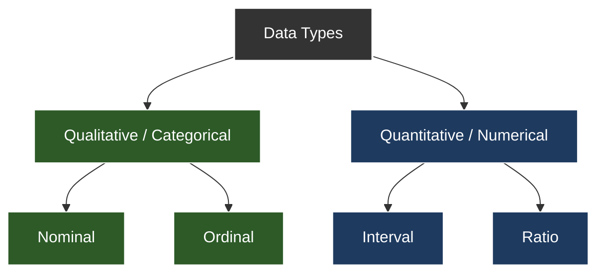

# Data Classification

Data can be further classified into four main types, building upon the categorical and numeric distinctions:

## Nominal
-   **Definition**: Categorical data without any intrinsic order or ranking. It's used purely for labeling or naming categories.
-   **Examples**:
    -   Colors: Red, Blue, Green
    -   Marital Status: Single, Married, Divorced
    -   Types of Animals: Dog, Cat, Bird

## Ordinal
-   **Definition**: Categorical data with a meaningful order or ranking, but the differences between categories are not precisely measurable or consistent.
-   **Examples**:
    -   Education Level: High School, Bachelor's, Master's, PhD
    -   Customer Satisfaction: Very Unsatisfied, Unsatisfied, Neutral, Satisfied, Very Satisfied
    -   Military Ranks: Private, Corporal, Sergeant

## Interval
-   **Definition**: Numeric data where the order matters, and the differences between values are meaningful and consistent. However, it lacks a true zero point, meaning zero does not indicate the absence of the quantity.
-   **Examples**:
    -   Temperature in Celsius or Fahrenheit: 0°C does not mean no temperature.
    -   Years: The year 0 AD is an arbitrary starting point.
    -   IQ Scores: A score of 0 doesn't mean no intelligence.

## Ratio
-   **Definition**: Numeric data that has all the properties of interval data, but also possesses a true and meaningful zero point, indicating the complete absence of the quantity being measured.
-   **Examples**:
    -   Height: 0 cm means no height.
    -   Weight: 0 kg means no weight.
    -   Age: 0 years means birth.
    -   Income: 0 dollars means no income.

# Data Quality Issues

## 1. Label Noise
-   **Issue**: Errors in the target variable (y).
    -   *Stochastic noise* (random errors) can be handled with enough data.
    -   *Systematic noise* (consistent errors, e.g., labeler bias) shifts the model's decision boundary.
-   **Mitigation**: **Confident Learning** – identify and remove noisy labels by ranking predicted probabilities.

## 2. Feature Drift & Covariate Shift
-   **What it is**: The distribution of input features P(x) changes between training and testing, but the relationship P(y|x) stays the same.
-   **Mitigation**: **Importance Sampling Re-weighting** – adjust training instances to match the test distribution.
-   **Detection**: Monitor feature distribution shifts using **Kullback-Leibler (KL) Divergence** or **Population Stability Index (PSI)**.

## 3. Data Leakage (Target Leakage)
-   **What it is**: Using features during training that won't be available during real-world prediction, or features that are direct proxies for the target.
-   **Example**: Using a "transaction_fraud_timestamp" feature in a fraud detection model, if that timestamp is only created *after* fraud is confirmed.
-   **Detection**: Check for high correlation or **Mutual Information** between features and the target.

## 4. Sparsity & Cold Start
-   **What it is**:
    -   **Sparsity**: Many features have zero values, especially in high-dimensional data.
    -   **Cold Start**: Difficulty making predictions for new items or users due to lack of historical data.
-   **Impact**: Leads to the **Curse of Dimensionality**, where distances become less meaningful.
-   **Mitigation**: **Feature hashing** or **embedding layers** to reduce dimensionality.

## 5. Data Imbalance & Selection Bias
-   **What it is**:
    -   **Selection Bias**: The data used for training isn't representative of the real-world data (P(x|sampled) $\neq$ P(x)).
    -   **Imbalance**: One class (e.g., minority class) is significantly underrepresented, causing models to ignore it.
-   **Mitigation**:
    -   Move beyond simple accuracy.
    -   Use metrics like **AUPRC** (Area Under Precision-Recall Curve).
    -   Employ **Cost-Sensitive Learning** (penalize errors on minority classes more heavily).

## 6. Numerical Stability Issues
-   **What it is**: Problems like **Vanishing/Exploding Gradients** during training, often due to unscaled features.
-   **Concept**: **Internal Covariate Shift** – changes in the distribution of network activations during training.
-   **Mitigation**:
    -   **Batch Normalization** to stabilize activation means and variances.
    -   For **Outliers**: Use **Huber Loss** instead of L2 loss for better robustness.