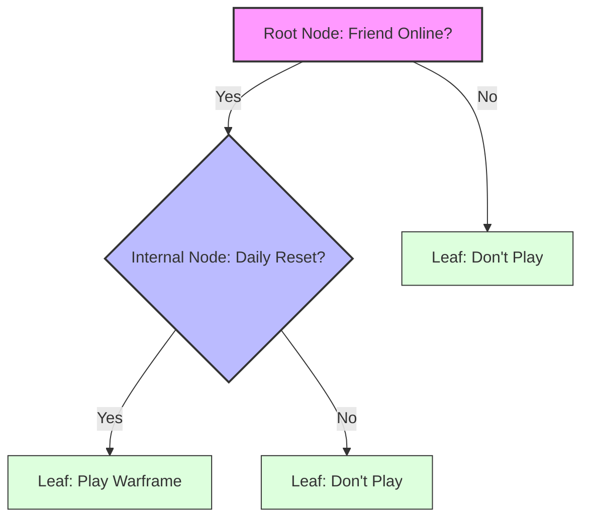

```mermaid

graph TD
    A[Root Node: Friend Online?] -- Yes --> B{Internal Node: Daily Reset?}
    A -- No --> C[Leaf: Don't Play]
    
    B -- Yes --> D[Leaf: Play Warframe]
    B -- No --> E[Leaf: Don't Play]

    style A fill:#f9f,stroke:#333,stroke-width:2px
    style B fill:#bbf,stroke:#333,stroke-width:2px
    style C fill:#dfd,stroke:#333,stroke-width:1px
    style D fill:#dfd,stroke:#333,stroke-width:1px
    style E fill:#dfd,stroke:#333,stroke-width:1px
```
