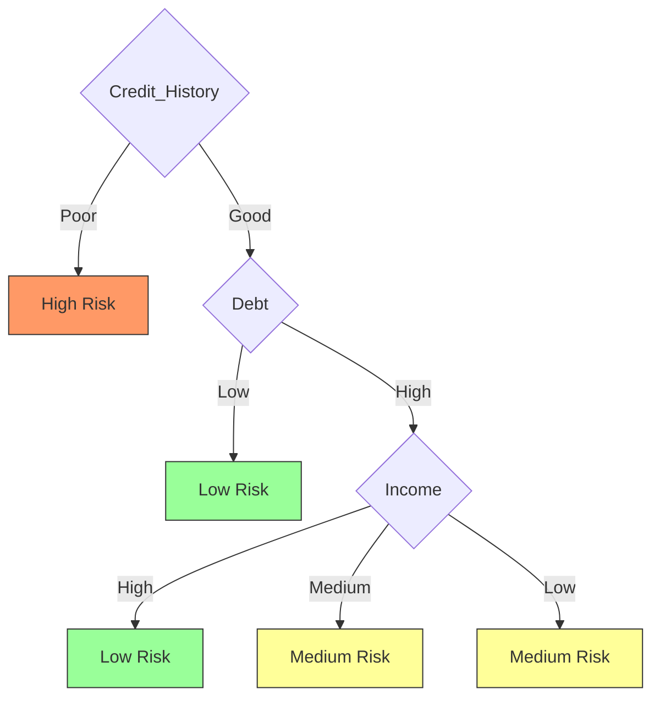

# ID3 Decision Tree

## Dataset: Credit Risk Assessment ($S$)

|**ID**|**Income**|**Credit_History**|**Debt**|**Risk (Target)**|
|---|---|---|---|---|
|1|High|Good|Low|**Low**|
|2|High|Poor|High|**High**|
|3|Medium|Good|Low|**Low**|
|4|Low|Good|Low|**Low**|
|5|Low|Poor|Low|**High**|
|6|Medium|Poor|High|**High**|
|7|High|Good|High|**Low**|
|8|Medium|Good|High|**Medium**|
|9|Low|Good|High|**Medium**|
|10|Medium|Poor|Low|**High**|

---

## Mathematical Framework

### Entropy ($H$)
$$\large H(S) = -\sum_{i \in \{L, M, H\}} p_i \log_2(p_i)$$
- $S$: Current dataset.
- $p_i$: Probability of class $i$ (Low, Medium, High)

### Information Gain ($IG$)
$$\large IG(S, A) = H(S) - \sum_{v \in Values(A)} \frac{|S_v|}{|S|} H(S_v)$$
- $A$: Attribute (Income, History, Debt).
- $S_v$: Subset where $A = v$.

---

## Root Node Selection

### I. Base Entropy $H(S)$

Total samples ($n=10$): Low=4, Medium=2, High=4.
$$\large H(S) = -\left[ \frac{4}{10}\log_2\frac{4}{10} + \frac{2}{10}\log_2\frac{2}{10} + \frac{4}{10}\log_2\frac{4}{10} \right] \approx 1.522$$

### II. Gain for 'Credit_History' ($A_{CH}$)

- **Good ($n=6$):** Low=4, Medium=2, High=0 $\rightarrow H(S_{good}) = -[\frac{4}{6}\log_2\frac{4}{6} + \frac{2}{6}\log_2\frac{2}{6}] \approx 0.918$
- **Poor ($n=4$):** Low=0, Medium=0, High=4 $\rightarrow H(S_{poor}) = 0$ (Pure)

$$\large IG(S, A_{CH}) = 1.522 - \left[ \frac{6}{10}(0.918) + \frac{4}{10}(0) \right] = 0.971$$

### III. Gain for 'Income' ($A_I$)

- **High ($n=3$):** Low=2, High=1 $\rightarrow H(S_{high}) \approx 0.918$
- **Medium ($n=4$):** Low=1, Med=1, High=2 $\rightarrow H(S_{med}) = 1.5$
- **Low ($n=3$):** Low=1, Med=1, High=1 $\rightarrow H(S_{low}) = 1.585$
$$\large IG(S, A_I) = 1.522 - \left[ \frac{3}{10}(0.918) + \frac{4}{10}(1.5) + \frac{3}{10}(1.585) \right] = 0.171$$

### IV. Decision
$$\max(IG(S, A_{CH}), IG(S, A_I), IG(S, A_D)) \implies \text{Root} = \text{Credit\_History}$$

---

## Recursive Sub-tree (Branch: History = Good)

For the subset $S_{good}$, we evaluate remaining attributes $\{Income, Debt\}$.

1. **Split on Debt:**
    - **Low ($n=3$):** All **Low Risk**. $H = 0$.
    - **High ($n=3$):** Low=1, Medium=2. $H = 0.918$.
2. **Split on Income:**
    - **High ($n=2$):** All **Low Risk**. $H = 0$.
    - **Med ($n=2$):** Low=1, Medium=1. $H = 1.0$.
    - **Low ($n=2$):** Low=1, Medium=1. $H = 1.0$.

$$\text{Next Node} = \text{Debt}$$

---

## Visualization

