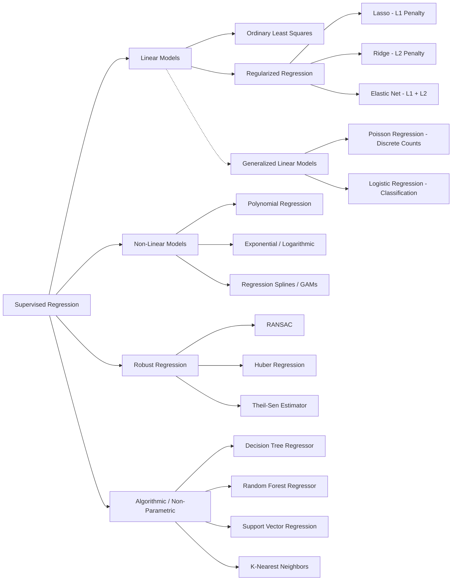

```mermaid
graph LR
    Supervised[Supervised Regression] --> Linear[Linear Models]
    Supervised --> NonLinear[Non-Linear Models]
    Supervised --> Robust[Robust Regression]
    Supervised --> Algorithmic[Algorithmic / Non-Parametric]

    %% Linear Branch
    Linear --> OLS[Ordinary Least Squares]
    Linear --> Regularized[Regularized Regression]
    Regularized --> L1[Lasso - L1 Penalty]
    Regularized --> L2[Ridge - L2 Penalty]
    Regularized --> Elastic[Elastic Net - L1 + L2]

    %% Non-Linear Branch
    NonLinear --> Poly[Polynomial Regression]
    NonLinear --> Exp[Exponential / Logarithmic]
    NonLinear --> Splines[Regression Splines / GAMs]

    %% Robust Branch
    Robust --> RANSAC[RANSAC]
    Robust --> Huber[Huber Regression]
    Robust --> TheilSen[Theil-Sen Estimator]

    %% Algorithmic Branch
    Algorithmic --> Tree[Decision Tree Regressor]
    Algorithmic --> Forest[Random Forest Regressor]
    Algorithmic --> SVR[Support Vector Regression]
    Algorithmic --> KNN[K-Nearest Neighbors]

    %% GLM Note
    Linear -.-> GLM[Generalized Linear Models]
    GLM --> Poisson[Poisson Regression - Discrete Counts]
    GLM --> Logistic[Logistic Regression - Classification]
```