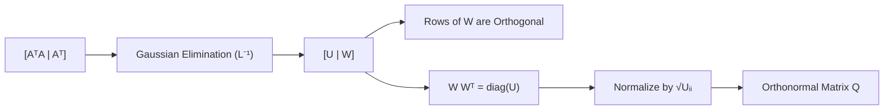

The process of performing row reduction on the augmented matrix $[A^T A \mid A^T]$ is a matrix-based implementation of the **Gram-Schmidt Orthogonalization**. It leverages the Cholesky-like decomposition of the Gram matrix to decouple the basis vectors.

---

### I. Mathematical Framework

Let $A \in M_{m \times n}(\mathbb{R})$ with linearly independent columns $\{v_1, \dots, v_n\}$.

The Gram matrix $G = A^T A$ contains all inner products $G_{ij} = \langle v_i, v_j \rangle$.

**The Augmented Matrix:**

$$M = [A^T A \mid A^T]$$

Applying Gaussian elimination (without row swaps to preserve the order of orthogonalization) transforms $G$ into an upper triangular matrix $U$. This is equivalent to multiplying $M$ by a lower triangular matrix $L^{-1}$ representing the elementary row operations.

$$L^{-1} [A^T A \mid A^T] = [U \mid L^{-1} A^T]$$

---

### II. The Resulting Structure

#### 1. Left Hand Side (LHS): $U$

The matrix $U$ is the upper triangular factor of the $LU$ decomposition of the Gram matrix $G$.

$$G = LU \implies L^{-1}G = U$$

The diagonal elements $U_{ii}$ represent the squared norms of the orthogonal vectors $u_i$ before normalization: $U_{ii} = \|u_i\|^2$.

#### 2. Right Hand Side (RHS): $W = L^{-1} A^T$

The rows of the RHS matrix, denoted $w_i^T$, are exactly the **orthogonal vectors** $u_i$ generated by the Gram-Schmidt process.

---

### III. Why the RHS consists of Orthogonal Vectors

The Gram-Schmidt process defines the $k$-th orthogonal vector $u_k$ as a linear combination of the current vector $v_k$ and previous orthogonal vectors:

$$u_k = v_k - \sum_{j=1}^{k-1} \frac{\langle v_k, u_j \rangle}{\|u_j\|^2} u_j$$

In matrix form, the transformation from the original basis $\{v_i\}$ to the orthogonal basis $\{u_i\}$ is a linear operator represented by the lower triangular matrix $L^{-1}$:

$$U_{basis} = L^{-1} A^T$$

**Proof of Orthogonality:**

To show that the rows of $W = L^{-1} A^T$ are orthogonal, we compute $W W^T$:

1. Recall $G = A^T A$.
    
2. From $L^{-1} G = U$, we have $G = L U$.
    
3. Since $G$ is symmetric, $G = G^T = U^T L^T$.
    
4. In the $LDU$ decomposition, $U = D L^T$ where $D = \text{diag}(U_{ii})$.
    
5. Substitute $G = L D L^T$.
    
6. Compute $W W^T$:
    
    $$W W^T = (L^{-1} A^T) (L^{-1} A^T)^T = L^{-1} (A^T A) (L^{-1})^T$$
    
    $$W W^T = L^{-1} (L D L^T) L^{-T} = D$$
    

Since $D$ is a diagonal matrix, the rows of $W$ (the RHS) are mutually orthogonal, with $w_i \cdot w_i = U_{ii}$.

---

### IV. Summary of Identities

|**Component**|**Expression**|**Meaning**|
|---|---|---|
|**Augmented Start**|$[A^T A \mid A^T]$|$[ \text{Gramian} \mid \text{Basis}^T ]$|
|**Row Operations**|$L^{-1}$|Accumulation of GS projections|
|**Final LHS**|$U$|$D L^T$ (Scaled projections)|
|**Final RHS**|$W$|Orthogonal rows $\{u_1^T, \dots, u_n^T\}$|
|**Orthonormalization**|$D^{-1/2} W$|Orthonormal rows $\{e_1^T, \dots, e_n^T\}$|

---

### V. Example Problem

> Given a basis generate all the orthonormal vectors: [[(Example) Orthonormalization via Gaussian Elimination]]
