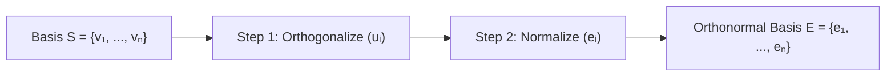
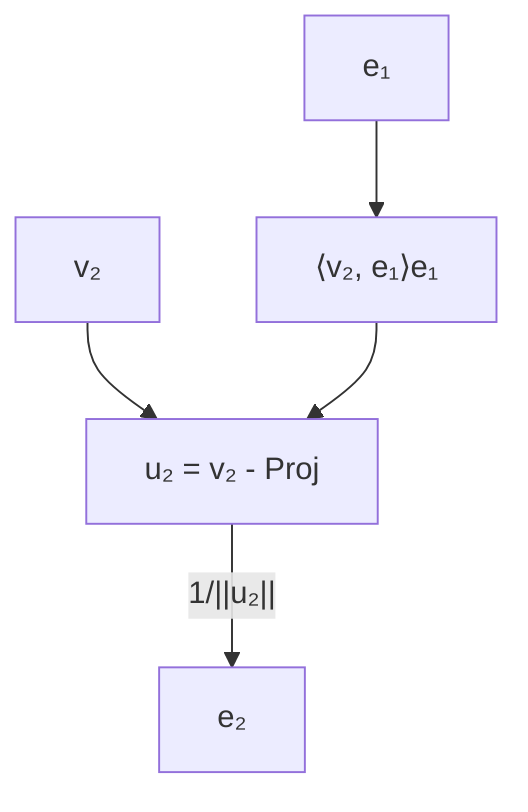

The Gram-Schmidt process is an algorithm for constructing an **orthonormal basis** from a given set of linearly independent vectors in an inner product space $(V, \langle \cdot, \cdot \rangle)$.

---

### I. Initial Conditions and Requirements

- **Input Basis:** A set of linearly independent vectors $S = \{v_1, v_2, \dots, v_n\} \subset V$.
    
- **Target:** A set of orthonormal vectors $E = \{e_1, e_2, \dots, e_n\}$ such that:
    
    1. $\text{span}\{e_1, \dots, e_k\} = \text{span}\{v_1, \dots, v_k\}$ for all $1 \leq k \leq n$.
        
    2. $\langle e_i, e_j \rangle = \delta_{ij}$ (where $\delta$ is the Kronecker delta).

---

### II. The Orthogonalization Step

We first define an intermediate orthogonal basis $U = \{u_1, u_2, \dots, u_n\}$.

#### Step 1: Base Case

$$u_1 = v_1$$

#### Step 2: Iterative Projection Removal

For $k = 2, 3, \dots, n$, the $k$-th orthogonal vector $u_k$ is obtained by subtracting the projections of $v_k$ onto all previously determined orthogonal vectors $u_1, \dots, u_{k-1}$:

$$u_k = v_k - \sum_{j=1}^{k-1} \text{proj}_{u_j}(v_k)$$

Expanding the projection operator $\text{proj}_u(v) = \frac{\langle v, u \rangle}{\langle u, u \rangle} u$:

$$u_k = v_k - \sum_{j=1}^{k-1} \frac{\langle v_k, u_j \rangle}{\langle u_j, u_j \rangle} u_j$$

---

### III. The Normalization Step

To transform the orthogonal set $U$ into the orthonormal set $E$, each vector must be scaled to unit length.

For each $i = 1, \dots, n$:

$$e_i = \frac{u_i}{\|u_i\|}$$

Where the norm is induced by the inner product: $\|u_i\| = \sqrt{\langle u_i, u_i \rangle}$.

---

### IV. Summary of Iterative Steps

The process is often computed by alternating projection and normalization to simplify the arithmetic:

1. $u_1 = v_1$; $\quad e_1 = \frac{u_1}{\|u_1\|}$
    
2. $u_2 = v_2 - \langle v_2, e_1 \rangle e_1$; $\quad e_2 = \frac{u_2}{\|u_2\|}$
    
3. $u_3 = v_3 - \langle v_3, e_1 \rangle e_1 - \langle v_3, e_2 \rangle e_2$; $\quad e_3 = \frac{u_3}{\|u_3\|}$
    
4. General form:
    
    $$u_k = v_k - \sum_{j=1}^{k-1} \langle v_k, e_j \rangle e_j, \quad e_k = \frac{u_k}{\|u_k\|}$$
 

---

### V. Matrix Representation (QR Decomposition)

The Gram-Schmidt process provides the theoretical basis for the **QR Decomposition** of a matrix $A \in M_{m \times n}(\mathbb{R})$ with linearly independent columns:

$$A = QR$$

- $Q$: An $m \times n$ matrix with orthonormal columns ($Q^T Q = I$).
    
- $R$: An $n \times n$ upper triangular matrix where $R_{ij} = \langle v_j, e_i \rangle$.

---

### VI. Example Problem

> Given a basis generate all the orthonormal vectors: [[(Example) Orthonormalization via Gaussian Elimination]]