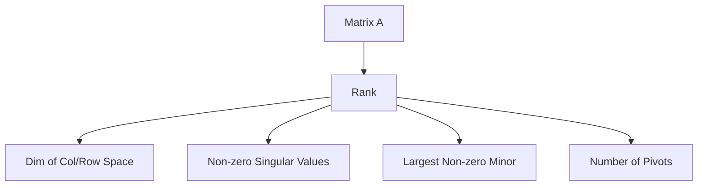

# Rank of a Matrix: Theory and Properties

In the category of linear algebra, the **rank** of a matrix $A \in \mathbb{M}_{m \times n}(\mathbb{F})$ is the dimension of the vector space spanned by its columns (or rows).

---
### I. General Operational Rules

- **Bound:** $0 \le \text{rank}(A) \le \min(m, n)$
- **Transposition:** $\text{rank}(A) = \text{rank}(A^T) = \text{rank}(A^H)$
- **Sub-additivity:** $\text{rank}(A + B) \le \text{rank}(A) + \text{rank}(B)$
- **Product Bounds:** * $\text{rank}(AB) \le \min(\text{rank}(A), \text{rank}(B))$
    - **Sylvester’s Rank Inequality:** $\text{rank}(A) + \text{rank}(B) - n \le \text{rank}(AB)$
- **Invariance:** Pre- or post-multiplication by an invertible matrix $P$ preserves rank:
$$\text{rank}(PAQ) = \text{rank}(A)$$

---

### II. Spectral and Structural Properties

#### 1. Eigenvalues and Diagonalizability

- For any $A$, $\text{rank}(A) \ge \text{number of non-zero eigenvalues}$.
- If $A$ is **diagonalizable**, $\text{rank}(A) = \text{number of non-zero eigenvalues}$.
- **Algebraic vs. Geometric Multiplicity:** $\text{rank}(A - \lambda I) = n - \text{gm}(\lambda)$.

#### 2. Symmetric Positive Definite (SPD) Matrices

- If $A$ is $n \times n$ SPD, then $A$ is necessarily full rank: $\text{rank}(A) = n$.
- For any $A \in \mathbb{M}_{m \times n}$, $\text{rank}(A^T A) = \text{rank}(A A^T) = \text{rank}(A)$.

#### 3. Orthonormal and Unitary Matrices

- If $Q \in \mathbb{M}_{n \times n}$ is orthonormal ($Q^T Q = I$), then $\text{rank}(Q) = n$.
- If $Q \in \mathbb{M}_{m \times n}$ has orthonormal columns ($m > n$), then $\text{rank}(Q) = n$ (Full column rank).

#### 4. Matrices Generated by Basis Vectors

- Let $A = [v_1 | v_2 | \dots | v_k]$.
- $\text{rank}(A) = k \iff \{v_i\}_{i=1}^k$ is linearly independent.
- If $\{v_i\}$ spans $V$, then $\text{rank}(A) = \dim(V)$.

---

### III. Advanced Identities

- **Frobenius Inequality:** $\text{rank}(AB) + \text{rank}(BC) \le \text{rank}(ABC) + \text{rank}(B)$
- **Outer Product:** $\text{rank}(A) = 1 \iff \exists u, v$ s.t. $A = uv^T$.
- **Singular Value Decomposition (SVD):** $\text{rank}(A) = \text{number of non-zero singular values } \sigma_i$.

