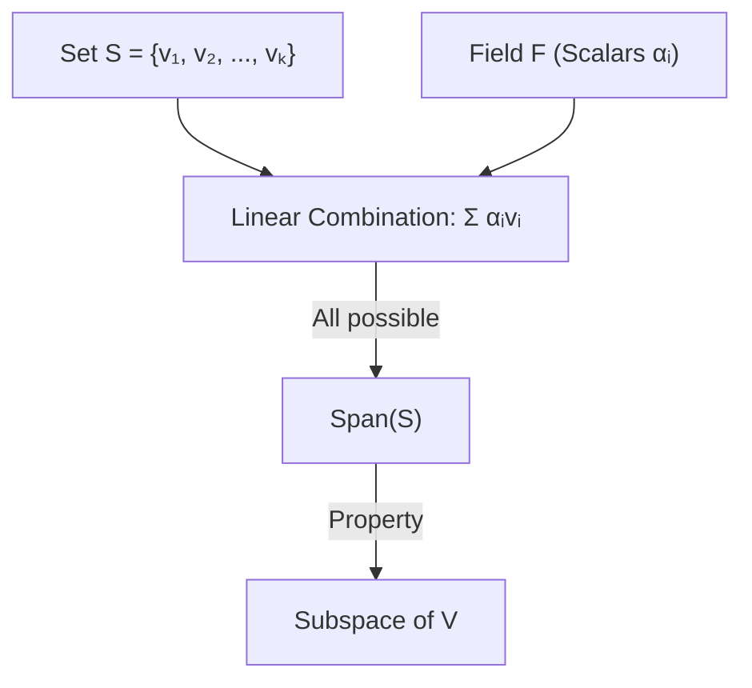
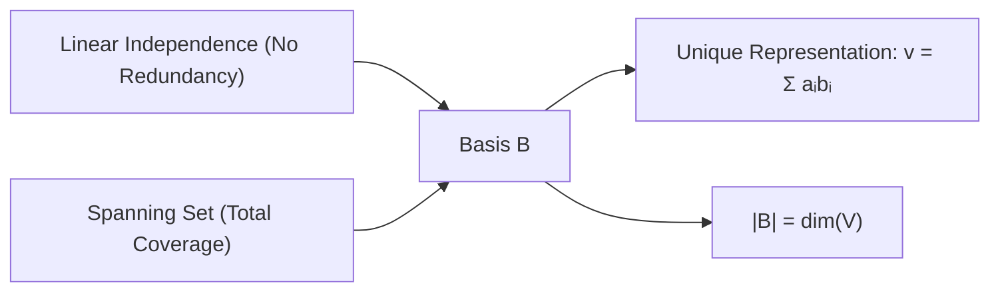

In a vector space $V$ over a field $F$, the structural integrity of the space is defined by the generating set and the lack of redundancy.

---

### I. Linear Combinations and Span

Given a set of vectors $S = \{v_1, v_2, \dots, v_k\} \subseteq V$, a **linear combination** is an element:

$$w = \sum_{i=1}^k \alpha_i v_i = \alpha_1 v_1 + \alpha_2 v_2 + \dots + \alpha_k v_k, \quad \alpha_i \in F$$

The **Span** of $S$, denoted $\text{span}(S)$, is the set of all possible linear combinations:

$$\text{span}(S) = \{ \sum_{i=1}^k \alpha_i v_i \mid \alpha_i \in F \}$$

---

### II. Linear Independence

A set $S$ is **linearly independent** if the vector equation:

$$\sum_{i=1}^k \alpha_i v_i = \mathbf{0}$$

has only the trivial solution $\alpha_1 = \alpha_2 = \dots = \alpha_k = 0$.

If there exists a non-trivial solution, $S$ is **linearly dependent**, implying at least one vector $v_j$ can be expressed as:

$$v_j = \sum_{i \neq j} \beta_i v_i$$

---

### III. Basis and Dimension

A set $\mathcal{B} = \{b_1, b_2, \dots, b_n\}$ is a **basis** for $V$ if:

1. $\mathcal{B}$ is linearly independent.
2. $\text{span}(\mathcal{B}) = V$.

**The Basis Theorem:**

If $V$ has a finite basis, every basis of $V$ contains the same number of vectors. This number is the **dimension** of $V$, denoted $\dim(V)$.

---

### IV. Mathematical Examples

|**Space V**|**Standard Basis B**|**dim(V)**|
|---|---|---|
|$\mathbb{R}^n$|$\{e_1, \dots, e_n\}$ where $e_i = (\delta_{ij})_{j=1}^n$|$n$|
|$P_n(x)$|$\{1, x, x^2, \dots, x^n\}$|$n+1$|
|$M_{2 \times 2}(\mathbb{R})$|$\left\{ \begin{pmatrix} 1 & 0 \\ 0 & 0 \end{pmatrix}, \begin{pmatrix} 0 & 1 \\ 0 & 0 \end{pmatrix}, \begin{pmatrix} 0 & 0 \\ 1 & 0 \end{pmatrix}, \begin{pmatrix} 0 & 0 \\ 0 & 1 \end{pmatrix} \right\}$|$4$|

**Coordinate Vector:**

For $v \in V$ and basis $\mathcal{B}$, the scalars $[v]_\mathcal{B} = (\alpha_1, \dots, \alpha_n)^T$ are unique such that $v = \sum \alpha_i b_i$.