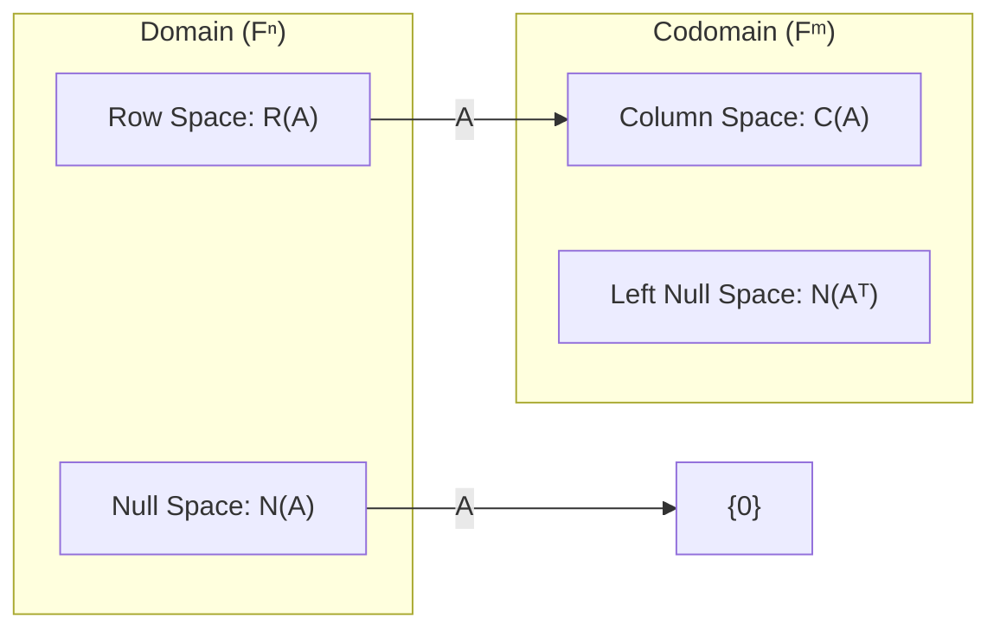
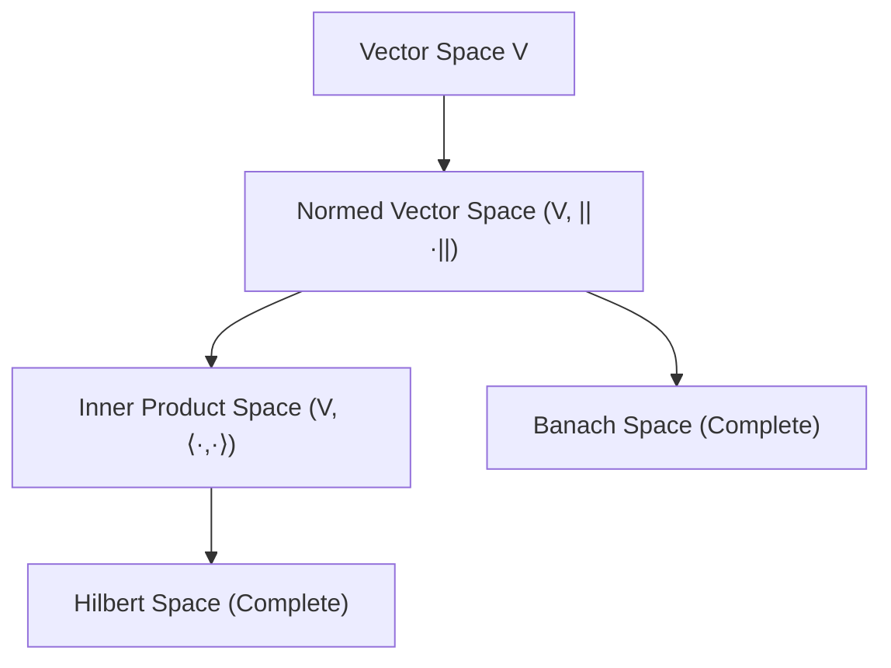

In a vector space $V$ over a field $F$, let $A \in M_{m \times n}(F)$ and $S = \{v_1, \dots, v_k\} \subseteq V$.

---

### I. Subspaces and Spans

- **Linear Span:** $\text{span}(S) = \{ \sum_{i=1}^k \alpha_i v_i \mid \alpha_i \in F \}$
- **Column Space:** $\mathcal{C}(A) = \{ Ax \mid x \in F^n \} \subseteq F^m$
- **Row Space:** $\mathcal{R}(A) = \mathcal{C}(A^T) \subseteq F^n$
- **Null Space (Kernel):** $\text{null}(A) = \ker(A) = \{ x \in F^n \mid Ax = \mathbf{0} \}$
- **Left Null Space:** $\text{null}(A^T) = \{ y \in F^m \mid A^T y = \mathbf{0} \}$

---

### II. Dimension and Rank

- **Dimension:** $\dim(V) = n$
- **Rank:** $\text{rank}(A) = \dim(\mathcal{C}(A)) = \dim(\mathcal{R}(A))$
- **Nullity:** $\text{nullity}(A) = \dim(\text{null}(A))$
- **Rank-Nullity Theorem:** $\text{rank}(A) + \text{nullity}(A) = n$

---

### III. Norms and Inner Products

- **Inner Product:** $\langle u, v \rangle \in F$
- **$L^p$ Norm:** $\|x\|_p = \left( \sum_{i=1}^n |x_i|^p \right)^{1/p}$
- **$L^2$ (Euclidean) Norm:** $\|x\|_2 = \sqrt{\langle x, x \rangle} = \sqrt{\sum x_i^2}$
- **$L^\infty$ (Supremum) Norm:** $\|x\|_\infty = \max_{i} |x_i|$
- **Induced Matrix Norm:** $\|A\| = \sup_{x \neq 0} \frac{\|Ax\|}{\|x\|}$

---

### IV. Orthogonality and Projections

- **Orthogonality:** $u \perp v \iff \langle u, v \rangle = 0$
- **Orthogonal Complement:** $S^\perp = \{ v \in V \mid \forall s \in S, \langle v, s \rangle = 0 \}$
- **Projection of $v$ onto $u$:** $\text{proj}_u(v) = \frac{\langle v, u \rangle}{\langle u, u \rangle} u$
- **Direct Sum Decomposition:** $V = W \oplus W^\perp$

---

### V. Operator and Transformation Notations

- **Linear Map:** $T: V \to W$ s.t. $T(au + bv) = aT(u) + bT(v)$
- **Eigenspace:** $E_\lambda = \ker(A - \lambda I)$
- **Characteristic Equation:** $p(\lambda) = \det(A - \lambda I) = 0$
- **Adjoint Operator:** $\langle Tu, v \rangle = \langle u, T^*v \rangle$

