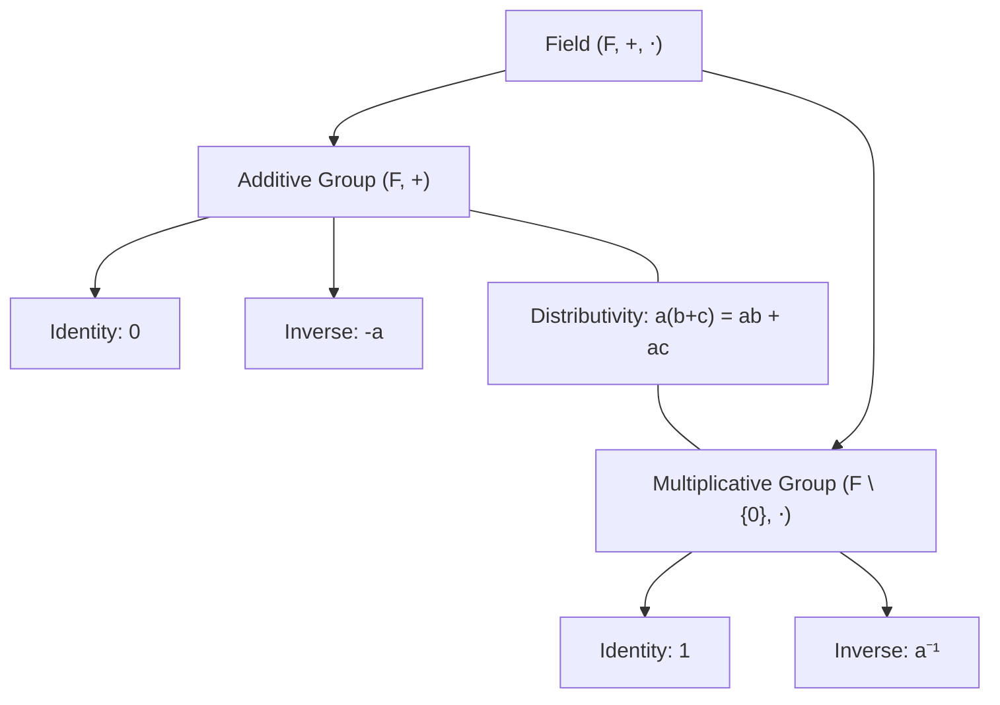
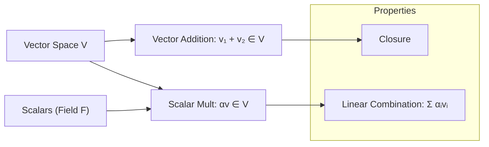

In modern algebra, a **Vector Space** $V$ is a structure built upon a **Field** $F$. Intuitively, the field provides the "scalars" (the scaling factors), while the vector space provides the "objects" that can be stretched and combined.

---

### I. The Field $F$

A field is a set $F$ equipped with two binary operations, addition $(+)$ and multiplication $(\cdot)$, satisfying the field axioms (associativity, commutativity, distributivity, and the existence of identities and inverses).

**Examples of Fields:**

- **Real Numbers:** $\mathbb{R}$
- **Complex Numbers:** $\mathbb{C}$
- **Rational Numbers:** $\mathbb{Q}$
- **Finite Fields:** $\mathbb{Z}_p$ (where $p$ is prime)

---

### II. The Vector Space $V$ over $F$

A vector space $(V, F, +, \cdot)$ consists of a set $V$ (vectors), a field $F$ (scalars), and two operations:

1. **Vector Addition:** $+ : V \times V \to V$
2. **Scalar Multiplication:** $\cdot : F \times V \to V$

#### Axiomatic Structure

For $u, v, w \in V$ and $a, b \in F$:

- **Commutativity:** $u + v = v + u$
- **Associativity:** $(u + v) + w = u + (v + w)$
- **Additive Identity:** $\exists \mathbf{0} \in V$ s.t. $v + \mathbf{0} = v$
- **Additive Inverse:** $\forall v, \exists -v$ s.t. $v + (-v) = \mathbf{0}$
- **Distributivity (Scalar):** $a(u + v) = au + av$
- **Distributivity (Field):** $(a + b)v = av + bv$
- **Scalar Associativity:** $a(bv) = (ab)v$
- **Unitary Law:** $1v = v$

---

### III. Intuitive Synthesis

A vector space is essentially a set that is **closed under linear combinations**. If you can scale elements and add them without leaving the set, you have a vector space.

#### Concrete Examples

|**Type**|**Space V**|**Field F**|**Typical Element**|
|---|---|---|---|
|**Euclidean**|$\mathbb{R}^n$|$\mathbb{R}$|$(x_1, x_2, \dots, x_n)$|
|**Polynomial**|$P_n(x)$|$\mathbb{R}$|$a_n x^n + \dots + a_0$|
|**Matrix**|$M_{m \times n}(\mathbb{R})$|$\mathbb{R}$|$A \in \mathbb{R}^{m \times n}$|
|**Function**|$C[a, b]$|$\mathbb{R}$|$f: [a, b] \to \mathbb{R}$|
