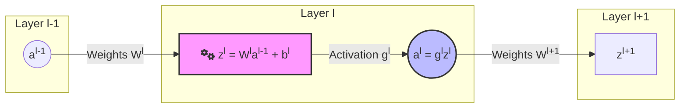
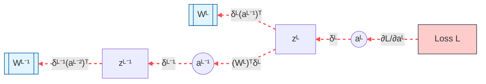

## Forward and Backward Propagation

### 1. Forward Propagation: The Inference Pass
Forward propagation is the process of calculating the output of a neural network by passing an input vector through successive layers.

For a single layer $l$:
1. **Linear Transformation:**
   $$\large \mathbf{z}^{[l]} = \mathbf{W}^{[l]} \mathbf{a}^{[l-1]} + \mathbf{b}^{[l]}$$
   Where $\mathbf{W}^{[l]}$ is the weight matrix, $\mathbf{a}^{[l-1]}$ is the activation from the previous layer, and $\mathbf{b}^{[l]}$ is the bias vector.

2. **Non-linear Activation:**
   $$\large \mathbf{a}^{[l]} = g^{[l]}(\mathbf{z}^{[l]})$$
   Where $g^{[l]}$ is the activation function (e.g., ReLU, Sigmoid).

---

### 2. Backward Propagation: The Learning Pass
Backward propagation calculates the gradient of the loss function $L$ with respect to every parameter in the network using the **Multivariate Chain Rule**.

#### Step 1: Output Layer Gradient
Assuming a loss function $L(\mathbf{a}^{[L]}, \mathbf{y})$ at the final layer $L$:
$$\large \frac{\partial L}{\partial \mathbf{z}^{[L]}} = \frac{\partial L}{\partial \mathbf{a}^{[L]}} \cdot \frac{\partial \mathbf{a}^{[L]}}{\partial \mathbf{z}^{[L]}}$$
For MSE loss and Sigmoid, this simplifies to $\mathbf{a}^{[L]} - \mathbf{y}$. We denote this error term as $\delta^{[L]}$.

#### Step 2: Hidden Layer Gradients (The Recursive Step)
To find the gradient for a hidden layer $l$, we propagate the error backward from layer $l+1$:
$$\large \delta^{[l]} = \frac{\partial L}{\partial \mathbf{z}^{[l]}} = \left( (\mathbf{W}^{[l+1]})^T \delta^{[l+1]} \right) \odot g'^{[l]}(\mathbf{z}^{[l]})$$
* $(\mathbf{W}^{[l+1]})^T \delta^{[l+1]}$ represents the error pushed back through the weights.
* $\odot$ is the element-wise (Hadamard) product with the derivative of the activation function.

#### Step 3: Parameter Gradients
Once we have the error term $\delta^{[l]}$, we calculate the partial derivatives for the actual weights and biases:
1. **Weight Gradient:**
   $$\large \frac{\partial L}{\partial \mathbf{W}^{[l]}} = \frac{\partial L}{\partial \mathbf{z}^{[l]}} \cdot \frac{\partial \mathbf{z}^{[l]}}{\partial \mathbf{W}^{[l]}} = \delta^{[l]} (\mathbf{a}^{[l-1]})^T$$
2. **Bias Gradient:**
   $$\large \frac{\partial L}{\partial \mathbf{b}^{[l]}} = \delta^{[l]}$$

---

### 3. Summary of Partial Derivatives
| Target Parameter | Gradient Notation | Mathematical Form |
| :--- | :--- | :--- |
| **Pre-activation** | $\delta^{[l]}$ | $\frac{\partial L}{\partial \mathbf{z}^{[l]}}$ |
| **Weights** | $d\mathbf{W}^{[l]}$ | $\delta^{[l]} (\mathbf{a}^{[l-1]})^T$ |
| **Biases** | $d\mathbf{b}^{[l]}$ | $\sum \delta^{[l]}$ (over batch) |

---

### 4. Gradient Descent Update
After backpropagation computes the gradients, the parameters are updated in the opposite direction of the gradient to minimize loss:
$$\mathbf{W}^{[l]} := \mathbf{W}^{[l]} - \alpha \frac{\partial L}{\partial \mathbf{W}^{[l]}}$$
$$\mathbf{b}^{[l]} := \mathbf{b}^{[l]} - \alpha \frac{\partial L}{\partial \mathbf{b}^{[l]}}$$
Where $\alpha$ is the **Learning Rate**.

---

### 5. Visualization

For your Obsidian notes, Mermaid is excellent for visualizing the structural flow of data and the "chain" of gradients. I've broken this into two diagrams: one for the **Forward Pass** and one for the **Backward Pass** showing the partial derivatives.

---

#### 1. Forward Propagation Flow

---

#### 2. Backpropagation & Gradient Chain

This visualizes the **Chain Rule** moving backward from the Loss function to the parameters.

---

#### 3. Summary of Operations

| **Step**         | **Mathematical Operation** | **Partial Derivative (Notation)**                                                        |
| ---------------- | -------------------------- | ---------------------------------------------------------------------------------------- |
| **Output Error** | Loss w.r.t Final Logit     | $\delta^{[L]} = \frac{\partial L}{\partial \mathbf{a}^{[L]}} \odot g'(\mathbf{z}^{[L]})$ |
| **Error Hidden** | Propagating $\delta$ back  | $\delta^{[l]} = ((\mathbf{W}^{[l+1]})^T \delta^{[l+1]}) \odot g'(\mathbf{z}^{[l]})$      |
| **Weight Grad**  | Error w.r.t Weights        | $\frac{\partial L}{\partial \mathbf{W}^{[l]}} = \delta^{[l]} (\mathbf{a}^{[l-1]})^T$     |
| **Bias Grad**    | Error w.r.t Bias           | $\frac{\partial L}{\partial \mathbf{b}^{[l]}} = \delta^{[l]}$                            |

