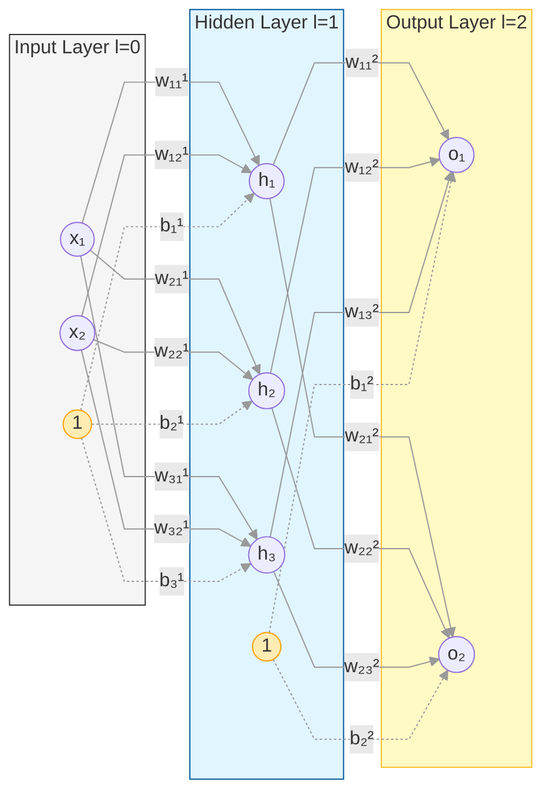
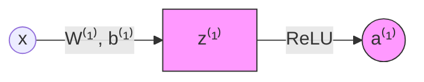
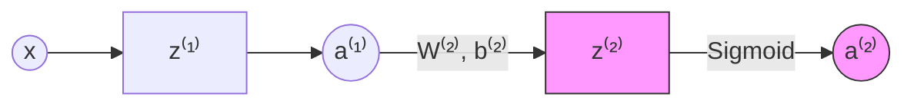
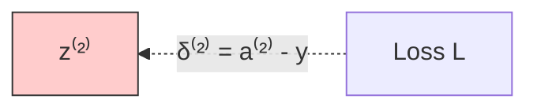
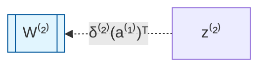
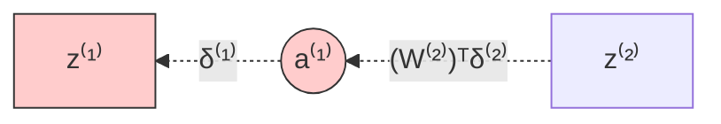
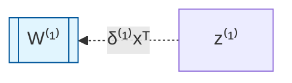

# Neural Network Derivation: [2, 3, 2] Architecture

## 1. Notation and Set Definitions

We formalize all parameters within the field of real numbers $\mathbb{R}$.

- **Batch Size ($m$):** We assume $m=1$ for this single-pass derivation.
- **$n^{[l]}$:** Number of neurons in layer $l$.

|**Layer**|**Type**|**Count (n[l])**|**Activation Function (g)**|
|---|---|---|---|
|**$l=0$**|Input Layer|$n^{[0]} = 2$|Linear feed-through|
|**$l=1$**|Hidden Layer|$n^{[1]} = 3$|**ReLU**: $g^{(1)}(z) = \max(0, z)$|
|**$l=2$**|Output Layer|$n^{[2]} = 2$|**Sigmoid**: $g^{(2)}(z) = \sigma(z) = \frac{1}{1+e^{-z}}$|

| **Component** | **Object**         | **Math Set**              | **Dimension**         |
| ------------- | ------------------ | ------------------------- | --------------------- |
| **Weights 1** | $\mathbf{W}^{[1]}$ | $\mathbb{R}^{3 \times 2}$ | $3$ rows, $2$ columns |
| **Bias 1**    | $\mathbf{b}^{[1]}$ | $\mathbb{R}^{3 \times 1}$ | $3$ rows, $1$ column  |
| **Weights 2** | $\mathbf{W}^{[2]}$ | $\mathbb{R}^{2 \times 3}$ | $2$ rows, $3$ columns |
| **Bias 2**    | $\mathbf{b}^{[2]}$ | $\mathbb{R}^{2 \times 1}$ | $2$ rows, $1$ column  |

---

## 2. Forward Propagation

### Step 2.1: Input to Hidden Layer ($l=1$)

The input vector $\mathbf{x}$ is transformed into the hidden state $\mathbf{a}^{[1]}$.

$$\large \mathbf{z}^{[1]} = \mathbf{W}^{[1]} \mathbf{x} + \mathbf{b}^{[1]}$$
$$\large \mathbf{a}^{[1]} = \text{ReLU}(\mathbf{z}^{[1]})$$

|**Variable**|**Definition**|**Dimension (n[l]×n[l−1])**|**Set**|
|---|---|---|---|
|$\mathbf{x}$|Input Vector|$2 \times 1$|$\mathbf{x} \in \mathbb{R}^{2}$|
|$\mathbf{W}^{[1]}$|Layer 1 Weights|$3 \times 2$|$\mathbf{W}^{[1]} \in \mathbb{R}^{3 \times 2}$|
|$\mathbf{b}^{[1]}$|Layer 1 Bias|$3 \times 1$|$\mathbf{b}^{[1]} \in \mathbb{R}^{3}$|
|$\mathbf{z}^{[1]}$|Layer 1 Pre-activation|$3 \times 1$|$\mathbf{z}^{[1]} \in \mathbb{R}^{3}$|
|$\mathbf{a}^{[1]}$|Layer 1 Activation|$3 \times 1$|$\mathbf{a}^{[1]} \in \mathbb{R}^{3}$|

### Step 2.2: Output Layer ($l=2$)

Compute the final transformation and Sigmoid activation:

$$\large \mathbf{z}^{[2]} = \mathbf{W}^{[2]} \mathbf{a}^{[1]} + \mathbf{b}^{[2]}$$
$$\large \mathbf{a}^{[2]} = \sigma(\mathbf{z}^{[2]}) = \frac{1}{1 + e^{-\mathbf{z}^{[2]}}}$$

---

## 3. Backward Propagation

### Step 3.1: Output Error ($\delta^{[2]}$)

We define the error term $\delta$ as the partial derivative of the loss $L$ with respect to the pre-activation $\mathbf{z}$.

$$\large \delta^{[2]} = \frac{\partial L}{\partial \mathbf{z}^{[2]}} = \mathbf{a}^{[2]} - \mathbf{y}$$
> Derivation for $\large \delta^{[2]}$ : [[(Subnotes) Backward Propagation Output Error]]

|**Variable**|**Definition**|**Dimension**|**Set**|
|---|---|---|---|
|$\mathbf{y}$|Ground Truth Label|$2 \times 1$|$\mathbf{y} \in \{0, 1\}^{2}$|
|$\delta^{[2]}$|Output Error Gradient|$2 \times 1$|$\delta^{[2]} \in \mathbb{R}^{2}$|

### Step 3.2: Output Parameter Gradients

Calculate partial derivatives for $\mathbf{W}^{[2]}$ and $\mathbf{b}^{[2]}$:

$$\large \frac{\partial L}{\partial \mathbf{W}^{[2]}} = \delta^{[2]} (\mathbf{a}^{[1]})^T, \quad \frac{\partial L}{\partial \mathbf{b}^{[2]}} = \delta^{[2]}$$
> Derivation for $\large \frac{\partial L}{\partial \mathbf{W}^{[2]}}$ and $\large \frac{\partial L}{\partial \mathbf{b}^{[2]}}$: [[(Subnotes) Backward Propagation Output Parameter Gradients]]

|**Term**|**Calculation**|**Dimensions**|**Resulting Shape**|**Match W[2]?**|
|---|---|---|---|---|
|**Weights**|$\delta^{[2]} (\mathbf{a}^{[1]})^T$|$(2 \times 1) \times (1 \times 3)$|$2 \times 3$|**Yes**|
|**Biases**|$\delta^{[2]}$|$2 \times 1$|$2 \times 1$|**Yes**|

### Step 3.3: Hidden Layer Error ($\delta^{[1]}$)

Propagate the error through the weights $\mathbf{W}^{[2]}$ and the ReLU derivative:

$$\large \delta^{[1]} = \left( (\mathbf{W}^{[2]})^T \delta^{[2]} \right) \odot g'(\mathbf{z}^{[1]})$$

_Note: $g'(z) = 1$ if $z > 0$, else $0$._

> Derivation for $\large \delta^{[1]}$: [[(Subnotes) Backward Propagation Hidden Layer Error]]

|**Variable**|**Definition**|**Dimension**|**Set**|
|---|---|---|---|
|$(\mathbf{W}^{[2]})^{T}$|Transposed Weights|$3 \times 2$|$(\mathbf{W}^{[2]})^{T} \in \mathbb{R}^{3 \times 2}$|
|$\delta^{[1]}$|Hidden Error Gradient|$3 \times 1$|$\delta^{[1]} \in \mathbb{R}^{3}$|

### Step 3.4: Hidden Parameter Gradients

Final gradients for the first layer using input $\mathbf{x}$:

$$\large \frac{\partial L}{\partial \mathbf{W}^{[1]}} = \delta^{[1]} \mathbf{x}^T, \quad \frac{\partial L}{\partial \mathbf{b}^{[1]}} = \delta^{[1]}$$

> Derivation for $\large \frac{\partial L}{\partial \mathbf{W}^{[1]}}$ and $\large \frac{\partial L}{\partial \mathbf{b}^{[1]}}$ [[(Subnotes) Backward Propagation Hidden Parameter Gradients]]

---

#### Gradient Table

| **Parameter**    | **The Chain Rule (Full Path)**                                                                                                                                    | **Substituted Final Equation**                                                         | **Dimension** |
| ---------------- | ----------------------------------------------------------------------------------------------------------------------------------------------------------------- | -------------------------------------------------------------------------------------- | ------------- |
| **Output Error** | $\frac{\partial L}{\partial \mathbf{a}^{[2]}} \cdot \frac{\partial \mathbf{a}^{[2]}}{\partial \mathbf{z}^{[2]}}$                                                  | $\large \delta^{[2]} = \mathbf{a}^{[2]} - \mathbf{y}$                                  | $2 \times 1$  |
| **Weights 2**    | $\delta^{[2]} \cdot \frac{\partial \mathbf{z}^{[2]}}{\partial \mathbf{W}^{[2]}}$                                                                                  | $\large d\mathbf{W}^{[2]} = \delta^{[2]} (\mathbf{a}^{[1]})^T$                         | $2 \times 3$  |
| **Biases 2**     | $\delta^{[2]} \cdot \frac{\partial \mathbf{z}^{[2]}}{\partial \mathbf{b}^{[2]}}$                                                                                  | $\large d\mathbf{b}^{[2]} = \delta^{[2]}$                                              | $2 \times 1$  |
| **Hidden Error** | $\left( \delta^{[2]} \cdot \frac{\partial \mathbf{z}^{[2]}}{\partial \mathbf{a}^{[1]}} \right) \odot \frac{\partial \mathbf{a}^{[1]}}{\partial \mathbf{z}^{[1]}}$ | $\large \delta^{[1]} = ((\mathbf{W}^{[2]})^T \delta^{[2]}) \odot g'(\mathbf{z}^{[1]})$ | $3 \times 1$  |
| **Weights 1**    | $\delta^{[1]} \cdot \frac{\partial \mathbf{z}^{[1]}}{\partial \mathbf{W}^{[1]}}$                                                                                  | $\large d\mathbf{W}^{[1]} = \delta^{[1]} \mathbf{x}^T$                                 | $3 \times 2$  |
| **Biases 1**     | $\delta^{[1]} \cdot \frac{\partial \mathbf{z}^{[1]}}{\partial \mathbf{b}^{[1]}}$                                                                                  | $\large d\mathbf{b}^{[1]} = \delta^{[1]}$                                              | $3 \times 1$  |

> [!tip] Implementation Note
> 
> When coding this, remember that $\mathbf{W}^{[1]}$ will be of shape $(3, 2)$ and $\mathbf{W}^{[2]}$ will be $(2, 3)$. Ensure you use the dot product for linear transforms and element-wise multiplication ($\odot$) for activation derivatives.
